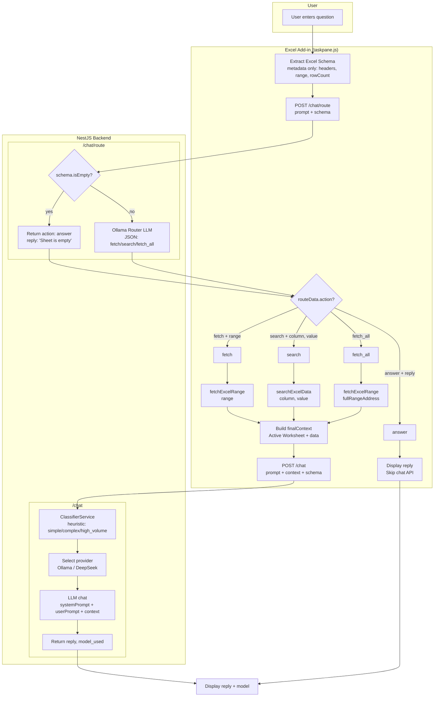

# Question Processing Flow

## Flow Summary

| Step | Component | Action |
|------|-----------|--------|
| 1 | Frontend | User sends question; extract schema (headers, range, rowCount) |
| 2 | Frontend | POST to `/chat/route` with prompt + schema |
| 3 | Backend Router | If sheet empty → return `{ action: 'answer', reply }` |
| 4 | Backend Router | Else → Ollama Router LLM returns JSON: `fetch` / `search` / `fetch_all` |
| 5 | Frontend | Fetch data: `fetchExcelRange(range)` or `searchExcelData(col, val)` or full range |
| 6 | Frontend | If `answer` → display reply and stop |
| 7 | Frontend | Else → POST to `/chat` with prompt + context + schema |
| 8 | Backend Answer | Classifier assigns task type (simple/complex/high_volume) |
| 9 | Backend Answer | Select LLM (Ollama / DeepSeek); call `chat()` |
| 10 | Frontend | Display reply and model used |
